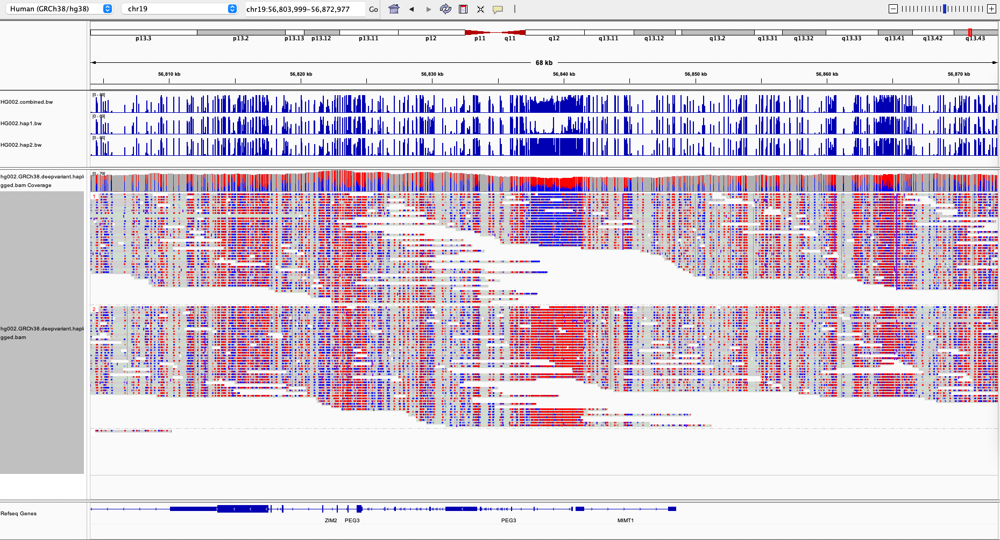

# pb-CpG-tools

pb-CpG-tools provides the tool `aligned_bam_to_cpg_scores`, which can generate site methylation probabilities from
mapped HiFi reads, including probabilities for each haplotype when reads are haplotagged. The site probabilities are
reported as both bed and bigwig file outputs. The example below from HG002 shows how these bigwig tracks can be used to
visualize both combined and haplotype-specific methylation probabilities in IGV

<p align="center">
  
</p>

## Getting started

### Installation

pb-CpG-tools is available for 64-bit Linux platforms. It can be installed either directly from the GitHub release tarball, or via conda as described below.

#### Install from GitHub

To install from github, download the latest release tarball compiled for 64-bit Linux on the
[github release channel](https://github.com/PacificBiosciences/pb-CpG-tools/releases/latest), then unpack the tar file.
For example, the pb-CpG-tools v3.0.0 release can be obtained as follows:

    wget https://github.com/PacificBiosciences/pb-CpG-tools/releases/download/v3.0.0/pb-CpG-tools-v3.0.0-x86_64-unknown-linux-gnu.tar.gz
    tar -xzf pb-CpG-tools-v3.0.0-x86_64-unknown-linux-gnu.tar.gz

The `aligned_bam_to_cpg_scores` binary is found in the `bin/` directory of the unpacked file distribution.
This can be run with the help option to test the binary and review latest usage details:

    pb-CpG-tools-v3.0.0-x86_64-unknown-linux-gnu/bin/aligned_bam_to_cpg_scores --help

#### Install from conda

For [conda](https://github.com/conda/conda) users, installing pb-CpG-tools on conda may be a more convenient option. pb-CpG-tools is available for conda on Linux from the `bioconda` channel. A new conda environment with the latest release can be created as follows:

    conda create -n pb-cpg-tools -c bioconda pb-cpg-tools

To test this environment, activate it and run `aligned_bam_to_cpg_scores` with the help option to review the latest usage details:

    conda activate pb-cpg-tools
    aligned_bam_to_cpg_scores --help

### Example command line

`aligned_bam_to_cpg_scores` includes a number of ways to summarize site probabilities for 5mC methylation,
detailed further below.  The recommended default workflow will use the `model` pileup mode and `denovo` modsites mode.
The command line below demonstrates running the tool on a mapped WGS bam for HG002 using the default modes:

    aligned_bam_to_cpg_scores \
      --bam HG002.hg38.pbmm2.bam \
      --output-prefix HG002.hg38.pbmm2 \
      --threads 8

## Input Alignment File

The input alignment file should contain mapped reads in BAM or CRAM format and have an associated index file (`.bai`,
`.csi` or `.crai`). 5mC base modification values are read from the `MM` and `ML` auxiliary tags which encode base
modifications and confidence values. These tags are further described in the
[SAM tag specification document](https://samtools.github.io/hts-specs/SAMtags.pdf).
These are the default tags for 5mC modifications on HiFi reads. 

Methylated reads must be mapped using a method that does not hard-clip supplementary alignments, such as:
  - [pbmm2](https://github.com/PacificBiosciences/pbmm2) (recommended)
  - minimap2 with the `-Y` flag.

The reason for this restriction is that any process which shortens reads in the BAM file without also recalculating
the `MM` and `ML` auxiliary tags will lead to an invalid decoding of the methylation values.

Note the following additional requirements on the input alignment file:
- CRAM format is supported but the corresponding fasta reference file must be specified in this case.
- Multiple base modification types may be present in the file's `MM` and `ML` tags, but only the `C+m` modification key
will be processed, other modification keys such as `A+a` will be ignored. 5mC modifications encoded with a
multiple-modification key, such as `C+mh`, cannot be used.

## Output Files

There are compressed bed (`.bed.gz`) and bigwig (`.bw`) files generated for the complete read set and each separate
haplotype (when haplotype tags are available in the bam). The bed files are a bgzipped text format that are easier to
review and contain additional site data, the bigwig files are an indexed binary format designed to be loaded into IGV for
visualization.

Including the bed file index (`.tbi`), the following 3 files are always generated:

```
[output-prefix].combined.bed.gz
[output-prefix].combined.bed.gz.tbi
[output-prefix].combined.bw
```

If haplotype information is present in the input alignment file, an additional 6 output files are expected:

```
[output-prefix].hap1.bed.gz
[output-prefix].hap1.bed.gz.tbi
[output-prefix].hap1.bw
[output-prefix].hap2.bed.gz
[output-prefix].hap2.bed.gz.tbi
[output-prefix].hap2.bw
```

### Bed file format

All bed file outputs include a header containing run metadata. The header format provides key/value pairs as
"##{key}={value}", and a final column names line as "#col1  col2  col3...". An example header is shown below:

```
##pb-cpg-tools-version=3.0.0
##cmdline="aligned_bam_to_cpg_scores --bam m84011_220902_175841_s1.HG002.pbmm2-1.13.1.GRCh38.bam --output-prefix HG002 --threads 16"
##pileup-mode=model
##modsites-mode=denovo
##min-coverage=4
##min-mapq=1
##basemod-source=primrose 1.3.99 (commit v1.3.0-7-g2b7d465)
#chrom  begin   end     mod_score       type    cov     est_mod_count   est_unmod_count discretized_mod_score
```

The bed file columns will differ between the `model` and `count` pileup methods, but both share the first six columns:

1. chromosome name
2. start coordinate
3. end coordinate
4. modification score
5. haplotype
6. coverage

Here the _modification score_ is the methylation probability at the site expressed as a percentage. See the section
on `--pileup-mode` below for a description of how this is calculated for each mode.

Additional columns in the bed output file depend on which pileup mode is selected. For the `count` pileup mode,
four additional columns are present:

7. modified site count
8. unmodified site count
9. average mod score
10. average unmod score

For the `model` pileup mode, three additional columns are present:

7. estimated modified site count (extrapolated from model modification score)
8. estimated unmodified site count (extrapolated from model modification score)
9. discretized modification score (calculated from estimated modified/unmodified site counts)

### Bigwig file format

The bigwig files are an indexed binary format which contain columns 1-4 listed above, and are preferred for loading
5mC tracks in IGV.

## Output modes and option details

The `--pileup-mode` argument selects the modification probability calculation
- `model`: (default) This is the recommended pileup mode. It uses distributions of modification scores and a
machine-learning model to calculate the modification probabilities across CpG sites.
- `count`: For a given site, all bases with a 5mC modification probability greater than 0.5 are classified as modified,
and all other bases are classified as unmodified. The methylation probability for a site is set to the proportion of
bases classified as modified. In addition, the count and average modification probability (expressed as a percentage),
are provided for both the modified and unmodified sets of bases in the bed file output.

The `--modsites-mode` argument determines which sites will be reported
- `denovo`: (default) This option will identify and output all CG sites found in the consensus sequence from the reads in the 
pileup. This allows reporting of CG sites with zero modification probability. This mode does not ensure that the
reference also displays a CG site (e.g., there could be sequence mismatches between the reads and reference). 
- `reference`: This option will identify and output all CG sites found in the reference sequences. This allows reporting
of CG sites with zero modification probability. This mode does not ensure that aligned reads also display a CG site
(e.g., there could be sequence mismatches between the reads and reference). 

Using the `--hap-tag` argument allows an arbitrary SAM tag to be used to identify haplotypes, rather than the default `HP`
tag. The haplotype values must be `0`, `1`, and `2`, where `0` is not assigned/ambiguous.

## Example Data

An aligned BAM file containing HiFi reads with 5mC tags (`HG002.GRCh38.haplotagged.bam`) is freely available for
download: https://downloads.pacbcloud.com/public/dataset/HG002-CpG-methylation-202202/

The sample is HG002/NA24385 from the Human Pangenome Reference Consortium HG002 Data Freeze v1.0, and is aligned to
GRCh38. There are also four unaligned bam files containing the HiFi reads. 

## Performance

Given a human ~30x WGS aligned BAM, such as the example data above, it should take approximately 40 minutes to
complete default mode pileup track generation on 8 threads using 6 Gb of memory. Runtime should scale
approximately linearly with thread count until limited by the filesystem's ability to read the bam file in parallel.
Peak memory demand should be approximately constant for a human sample at 6 Gb regardless of thread count.

## Breaking changes from pb-CpG-tools v2

Upgrading from v2 to v3 of pb-CpG-tools could require adjustments to the command-line and output file processing:

- The `--model` argument is no longer required or accepted. All recommended machine-learning model details are built
directly into pb-CpG-tools.
- All bed file outputs are now bgzip-compressed with an additional ".gz" extension compared to the v2 output. Each bed
file output also includes a tabix index file.
- All bed files now include a metadata header comprised of several lines starting with the `#` character.

## DISCLAIMER

THIS WEBSITE AND CONTENT AND ALL SITE-RELATED SERVICES, INCLUDING ANY DATA, ARE PROVIDED "AS IS," WITH ALL FAULTS, WITH
NO REPRESENTATIONS OR WARRANTIES OF ANY KIND, EITHER EXPRESS OR IMPLIED, INCLUDING, BUT NOT LIMITED TO, ANY WARRANTIES
OF MERCHANTABILITY, SATISFACTORY QUALITY, NON-INFRINGEMENT OR FITNESS FOR A PARTICULAR PURPOSE. YOU ASSUME TOTAL
RESPONSIBILITY AND RISK FOR YOUR USE OF THIS SITE, ALL SITE-RELATED SERVICES, AND ANY THIRD PARTY WEBSITES OR
APPLICATIONS. NO ORAL OR WRITTEN INFORMATION OR ADVICE SHALL CREATE A WARRANTY OF ANY KIND. ANY REFERENCES TO SPECIFIC
PRODUCTS OR SERVICES ON THE WEBSITES DO NOT CONSTITUTE OR IMPLY A RECOMMENDATION OR ENDORSEMENT BY PACIFIC BIOSCIENCES.
