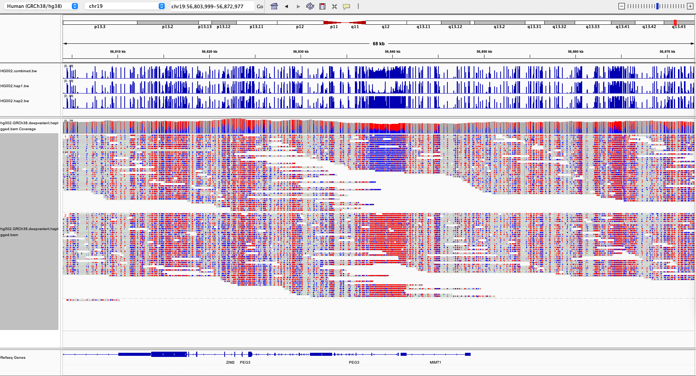

# pb-CpG-tools

pb-CpG-tools provides the tool `aligned_bam_to_cpg_scores`, which can generate site methylation probabilities from
mapped HiFi reads, including probabilities for each haplotype when reads are haplotaged. The site probabilities are
reported as both bed and bigwig file outputs. The example below from HG002 shows how these bigwig tracks can be used to
visualize both combined and haplotype-specific methylation probabilities in IGV

<p align="center">
  
</p>

## Getting started

To use `aligned_bam_to_cpg_scores` download the latest release tarball compiled for 64-bit linux platforms on the 
[github release channel](https://github.com/PacificBiosciences/pb-CpG-tools/releases/latest), then unpack the tar file.
As an example, the v2.3.0 release can be obtained as follows:

    wget https://github.com/PacificBiosciences/pb-CpG-tools/releases/download/v2.3.0/pb-CpG-tools-v2.3.0-x86_64-unknown-linux-gnu.tar.gz
    tar -xzf pb-CpG-tools-v2.3.0-x86_64-unknown-linux-gnu.tar.gz

    # Run help option to test binary and see latest usage details:
    pb-CpG-tools-v2.3.0-x86_64-unknown-linux-gnu/bin/aligned_bam_to_cpg_scores --help

`aligned_bam_to_cpg_scores` includes a number of ways to summarize site propabilities for 5mC methylation,
detailed below.  The recommended default workflow will use the `model` pileup mode and `denovo` modsites mode.
Continuing from the example above, the script below runs the tool on a mapped WGS bam for HG002:

    pb-CpG-tools-v2.3.0-x86_64-unknown-linux-gnu/bin/aligned_bam_to_cpg_scores \
      --bam HG002.hg38.pbmm2.bam \
      --output-prefix HG002.hg38.pbmm2 \
      --model pb-CpG-tools-v2.3.0-x86_64-unknown-linux-gnu/models/pileup_calling_model.v1.tflite \
      --threads 8

See the cmdline usage help for the full list of other commandline options:

    aligned_bam_to_cpg_scores --help

## Input Alignment File

The input alignment file should contain mapped reads in BAM or CRAM format and have an associated index file (`.bai`,
`.csi` or `.crai`). 5mC base modification values are read from the `MM` and `ML` auxiliary tags which encode base
modifications and confidence values. These tags are further described in the
[SAM tag specification document](https://samtools.github.io/hts-specs/SAMtags.pdf).
These are the default tags generated by [primrose](https://github.com/PacificBiosciences/primrose) for 5mC modifications
on HiFi reads. 

**These tools are explicitly designed for 5mC tags (e.g. `MM:Z:C+m`) and do not support other modification types or
tags in multiple-modification format.**

Note that when providing an input alignment file in CRAM format, you must also specify the fasta reference file used
to map the reads.

## Output Files

There are bed (`.bed`) and bigwig (`.bw`) files generated for the complete read set and each separate
haplotype (when haplotype tags are available in the bam). The bed files are a text format that is easier to review and
contains additional site data, the bigwig files are an indexed binary format designed to be loaded into IGV for
visualization.

The following 2 files are always generated:

```
[output-prefix].combined.bed
[output-prefix].combined.bw
```

If haplotype information is present in the input alignment file, an additional 4 output files are expected:

```
[output-prefix].hap1.bed 
[output-prefix].hap1.bw 
[output-prefix].hap2.bed
[output-prefix].hap2.bw
```

### Bed file format

The bed file columns will differ between the `model` and `count` pileup methods, but both share the first six columns:

1. reference name
2. start coordinate
3. end coordinate
4. modification score
5. haplotype
6. coverage

Here the _modification score_ is the methylation probability at the site expressed as a percentage. See the section
on `--pileup-mode` below for a description of how this is calculated for each mode.

Additional columns in the bed output file depend on which pileup mode is selected. For the `count` pileup mode,
four additional columns are present:

7. modified site count
8. unmodified site count
9. avg mod score
10. avg unmod score

For the `model` pileup mode, three additional columns are present:

7. estimated modified site count (extrapolated from model modification probability)
8. estimated unmodified site count (extrapolated from model modification probability)
9. discretized modification probability (calculated from estimated mod/unmod site counts)

### Bigwig file format

The bigwig files are an indexed binary format which contain columns 1-4 listed above, and are preferred for loading
5mC tracks in IGV.

## Output modes and option details

The `--pileup-mode` argument selects the modification probability calculation
- `model`: (default) This is the recommended pileup mode. It uses distributions of modification
scores and a machine-learning model to calculate the modification probabilities across CpG sites. When using this option
a path to a tflite model file must be provided with the `--model` argument. The current recommended model is
`pileup_calling_model.v1.tflite` found in the [models](models) directory.
- `count`: For a given site, all bases with a 5mC modification probability greater than 0.5 are classified as modified,
and all other bases are classified as unmodified. The methylation probability for a site is set to the proportion of
bases classified as modified. In addition, the count and average modification probability (expressed as a percentage),
are provided for both the modified and unmodified sets of bases in the bed file output.

The `--modsites-mode` argument determines which sites will be reported
- `denovo`: (default) This option will identify and output all CG sites found in the consensus sequence from the reads in the 
pileup. This allows reporting of CG sites with zero modification probability. This mode does not ensure that the
reference also displays a CG site (e.g., there could be sequence mismatches between the reads and reference). 
- `reference`: This option will identify and output all CG sites found in the reference sequences. This allows reporting
of CG sites with zero modification probability. This mode does not ensure that aligned reads also display a CG site
(e.g., there could be sequence mismatches between the reads and reference). 

Using the `--hap-tag` flag allows an arbitrary SAM tag to be used to identify haplotypes, rather than the default `HP`
tag. The haplotype values must be `0`, `1`, and `2`, where `0` is not assigned/ambiguous.

## Example Data

An aligned BAM file containing HiFi reads with 5mC tags (`HG002.GRCh38.haplotagged.bam`) is freely available for
download: https://downloads.pacbcloud.com/public/dataset/HG002-CpG-methylation-202202/

The sample is HG002/NA24385 from the Human Pangenome Reference Consortium HG002 Data Freeze v1.0, and is aligned to
GRCh38. There are also four unaligned bam files containing the HiFi reads. 

## Performance

Given a human ~30x WGS aligned BAM, such as the example data above, it should take approximately 40 minutes to
complete default mode pileup track generation on 8 threads using 6 Gb of memory. Runtime should scale
approximately linearly with thread count until limited by the filesystem's ability to read the bam file in parallel.
Peak memory demand should be approximately constant for a human sample at 6 Gb regardless of thread count.

## Comparison to Version 1

5mC site analysis was previously provided by the `aligned_bam_to_cpg_scores.py` python script in version 1.x releases.

The version 2 release of `aligned_bam_to cpg_scores` should have approximate feature parity with the previous script,
although the command-line details have changed.

Given the same bam file and selected output modes, version 2 results should logically match the version 1 script,
however the results will contain a number of minor expected differences:

1. Floating point thresholds and rounding differences lead to a small number of scoring differences.
2. In `denovo` modsites mode, tie-breaking details of the python implementation lead to a very small number of 
marginally `denovo` detected CpG not being included in this version.
3. The version 1 script output has some minor artifacts at its parallel 'chunksize' boundaries. These issues do not
occur in version 2.
4. In count pileup mode, the bam ML tag values are translated into probabilities by taking bin mid-points, so all
input probabilities are shifted by +(1/512) compared to version 1, which has a corresponding influence on the summarized
site output.

### Version 1 availability

The python version of the code is deprecated, but if needed the final version of this script before the version 2 update
is [available here](https://github.com/PacificBiosciences/pb-CpG-tools/tree/v1.2.0).

## DISCLAIMER

THIS WEBSITE AND CONTENT AND ALL SITE-RELATED SERVICES, INCLUDING ANY DATA, ARE PROVIDED "AS IS," WITH ALL FAULTS, WITH
NO REPRESENTATIONS OR WARRANTIES OF ANY KIND, EITHER EXPRESS OR IMPLIED, INCLUDING, BUT NOT LIMITED TO, ANY WARRANTIES
OF MERCHANTABILITY, SATISFACTORY QUALITY, NON-INFRINGEMENT OR FITNESS FOR A PARTICULAR PURPOSE. YOU ASSUME TOTAL
RESPONSIBILITY AND RISK FOR YOUR USE OF THIS SITE, ALL SITE-RELATED SERVICES, AND ANY THIRD PARTY WEBSITES OR
APPLICATIONS. NO ORAL OR WRITTEN INFORMATION OR ADVICE SHALL CREATE A WARRANTY OF ANY KIND. ANY REFERENCES TO SPECIFIC
PRODUCTS OR SERVICES ON THE WEBSITES DO NOT CONSTITUTE OR IMPLY A RECOMMENDATION OR ENDORSEMENT BY PACIFIC BIOSCIENCES.
